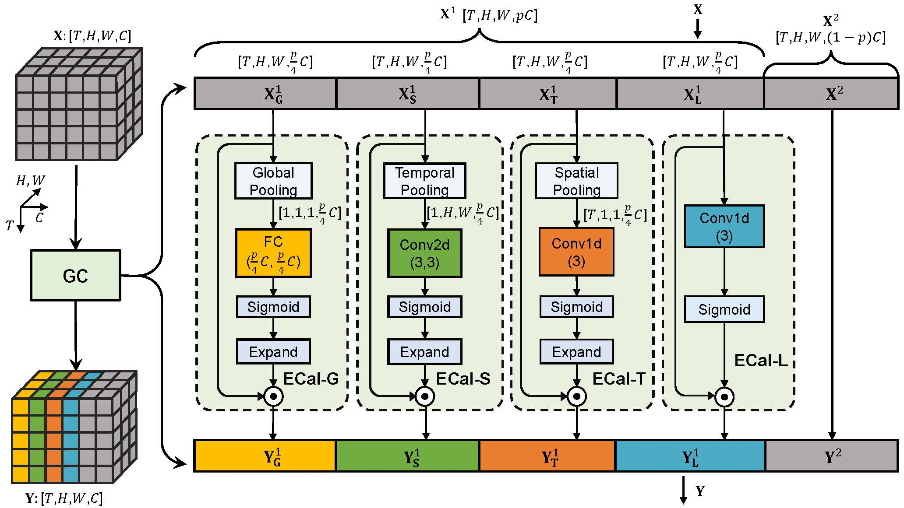

# Group Contextualization for Video Recognition (CVPR 2022)
This is an official implementaion of paper "Group Contextualization for Video Recognition", which has been accepted by CVPR 2022. [`Paper link`](https://arxiv.org/abs/2203.09694)
<div align="center">
  
</div>


## Updates
### March 11, 2022
* Release this V1 version (the version used in paper) to public. Complete codes and models will be released soon.

## Content

- [Prerequisites](#prerequisites)
- [Data Preparation](#data-preparation)
- [Code](#code)
- [Pretrained Models](#pretrained-models)
  * [Kinetics-400](#kinetics-400)
  * [Something-Something](#something-something)
    + [Something-Something-V1](#something-something-v1)
    + [Something-Something-V2](#something-something-v2)
  * [Diving48](#Diving48)
  * [EGTEA Gaze+](#EGTEA-Gaze)
- [Train](#Train)
- [Test](#Test)
- [Contibutors](#Contributors)
- [Citing](#Citing)
- [Acknowledgement](#Acknowledgement)

## Prerequisites

The code is built with following libraries:
* PyTorch >= 1.7, torchvision
* tensorboardx

For video data pre-processing, you may need [ffmpeg](https://www.ffmpeg.org/).

## Data Preparation

For GC-TSN, GC-GST, GC-TSM, we need to first extract videos into frames for all datasets ([Kinetics-400](https://deepmind.com/research/open-source/open-source-datasets/kinetics/), [Something-Something V1](https://20bn.com/datasets/something-something/v1) and [V2](https://20bn.com/datasets/something-something/v2), [Diving48](http://www.svcl.ucsd.edu/projects/resound/dataset.html) and [EGTEA Gaze+](http://cbi.gatech.edu/fpv)), following the [TSN](https://github.com/yjxiong/temporal-segment-networks) repo. While for GC-TDN, the data process follows the backbone [TDN](https://github.com/MCG-NJU/TDN) work, which resizes the short edge of video to 320px and directly decodes video mp4 file during training/evaluation.


## Code

GC-TSN/TSM/GST/TDN codes are based on [TSN](https://github.com/yjxiong/temporal-segment-networks), [TSM](https://github.com/mit-han-lab/temporal-shift-module), [GST](https://github.com/chenxuluo/GST-video) and [TDN](https://github.com/MCG-NJU/TDN) codebases, respectively. 


## Pretrained Models

Here we provide some of the pretrained models. 

### Kinetics-400

| Model             | Frame * view * clip    | Top-1 Acc. | Top-5 Acc. | Checkpoint |
| ----------------- | ----------- | ---------- | ----------- | ---------------- |
| GC-TSN ResNet50   | 8 * 1 * 10  | 75.2%      | 92.1%     | [link]() |
| GC-TSM ResNet50   | 8 * 1 * 10  | 75.4%      | 91.9%     | [link]() |
| GC-TSM ResNet50   | 16 * 1 * 10 | 76.7%      | 92.9%     | [link]() |
| GC-TSM ResNet50   | 16 * 3 * 10 | 77.1%      | 92.9%     | [link]() |
| GC-TDN ResNet50   | 8 * 3 * 10  | 77.3%      | 93.2%     | [link]() |
| GC-TDN ResNet50   | 16 * 3 * 10  | 78.8%      | 93.8%     | [link]() |
| GC-TDN ResNet50   | (8+16) * 3 * 10  | 79.6%   | 94.1%     |  |


### Something-Something

Something-Something [V1](https://20bn.com/datasets/something-something/v1)&[V2](https://20bn.com/datasets/something-something) datasets are highly temporal-related. Here, we 
use the 224×224 resolution for performance report.

#### Something-Something-V1

| Model             | Frame * view * clip    | Top-1 Acc. | Top-5 Acc. | Checkpoint |
| ----------------- | ----------- | ---------- | ----------- | ---------------- |
| GC-GST ResNet50   | 8 * 1 * 2  | 48.8%      | 78.5%     | [link]() |
| GC-GST ResNet50   | 16 * 1 * 2  | 50.4%      | 79.4%     | [link]() |
| GC-GST ResNet50   | (8+16) * 1 * 2  | 52.5%      | 81.3%     |  |
| GC-TSN ResNet50   | 8 * 1 * 2  | 49.7%      | 78.2%     | [link]() |
| GC-TSN ResNet50   | 16 * 1 * 2  | 51.3%      | 80.0%     | [link]() |
| GC-TSN ResNet50   | (8+16) * 1 * 2  | 53.7%      | 81.8%     |  |
| GC-TSM ResNet50   | 8 * 1 * 2  | 51.1%      | 79.4%     | [link]() |
| GC-TSM ResNet50   | 16 * 1 * 2 | 53.1%      | 81.2%     | [link]() |
| GC-TSM ResNet50   | (8+16) * 1 * 2 | 55.0%      | 82.6%     |  |
| GC-TSM ResNet50   | (8+16) * 3 * 2  | 55.3%      | 82.7%     |  |
| GC-TDN ResNet50   | 8 * 1 * 1  | 53.7%      | 82.2%     | [link]() |
| GC-TDN ResNet50   | 16 * 1 * 1  | 55.0%      | 82.3%     | [link]() |
| GC-TDN ResNet50   | (8+16) * 1 * 1  | 56.4%   | 84.0%     |  |

#### Something-Something-V2

| Model             | Frame * view * clip    | Top-1 Acc. | Top-5 Acc. | Checkpoint |
| ----------------- | ----------- | ---------- | ----------- | ---------------- |
| GC-GST ResNet50   | 8 * 1 * 2  | 61.9%      | 87.8%     | [link]() |
| GC-GST ResNet50   | 16 * 1 * 2  | 63.3%      | 88.5%     | [link]() |
| GC-GST ResNet50   | (8+16) * 1 * 2  | 65.0%      | 89.5%     |  |
| GC-TSN ResNet50   | 8 * 1 * 2  | 62.4%      | 87.9%     | [link]() |
| GC-TSN ResNet50   | 16 * 1 * 2  | 64.8%      | 89.4%     | [link]() |
| GC-TSN ResNet50   | (8+16) * 1 * 2  |66.3%      | 90.3%     |  |
| GC-TSM ResNet50   | 8 * 1 * 2  | 63.0%      | 88.4%     | [link]() |
| GC-TSM ResNet50   | 16 * 1 * 2 | 64.9%      | 89.7%     | [link]() |
| GC-TSM ResNet50   | (8+16) * 1 * 2 | 66.7%      | 90.6%     |  |
| GC-TSM ResNet50   | (8+16) * 3 * 2  | 67.5%      | 90.9%     |  |
| GC-TDN ResNet50   | 8 * 1 * 1  | 64.9%      | 89.7%     | [link]() |
| GC-TDN ResNet50   | 16 * 1 * 1  | 65.9%      | 90.0%     | [link]() |
| GC-TDN ResNet50   | (8+16) * 1 * 1  | 67.8%   | 91.2%     |  |

### Diving48
| Model             | Frame * view * clip    | Top-1 Acc. |  Checkpoint |
| ----------------- | ----------- | ---------- | ----------- |
| GC-GST ResNet50   | 16 * 1 * 1  | 82.5%     | [link]() |
| GC-TSN ResNet50   | 16 * 1 * 1  | 86.8%     | [link]() |
| GC-TSM ResNet50   | 16 * 1 * 1  | 87.2%     | [link]() |
| GC-TDN ResNet50   | 16 * 1 * 1  | 87.6%     | [link]() |


### EGTEA Gaze
| Model             | Frame * view * clip    | Split1 |  Split2 | Split3 |
| ----------------- | ----------- | ---------- | ----------- | ----------- |
| GC-GST ResNet50   | 8 * 1 * 1  | 65.5%     | 61.6%    | 60.6%  |
| GC-TSN ResNet50   | 8 * 1 * 1  | 66.4%     | 64.6%    | 61.4%  |
| GC-TSM ResNet50   | 8 * 1 * 1  | 66.5%     | 66.1%    | 62.6%  |
| GC-TDN ResNet50   | 8 * 1 * 1  | 65.0%     | 61.8%    | 61.0%  |

## Train 

 ```
  ```

## Test 

We provided several examples to train TSM with this repo:

```
```

## Contributors
GC codes are jointly written and owned by [Dr. Yanbin Hao](https://haoyanbin918.github.io/) and [Dr. Hao Zhang](https://hzhang57.github.io/).

## Citing
```bash
@article{gc2022,
  title={Group Contextualization for Video Recognition},
  author={Yanbin Hao, Hao Zhang, Chong-Wah Ngo, Xiangnan He},
  journal={CVPR 2022},
}
```

## Acknowledgement
Thanks for the following Github projects:
- https://github.com/yjxiong/temporal-segment-networks
- https://github.com/mit-han-lab/temporal-shift-module
- https://github.com/chenxuluo/GST-video
- https://github.com/MCG-NJU/TDN

